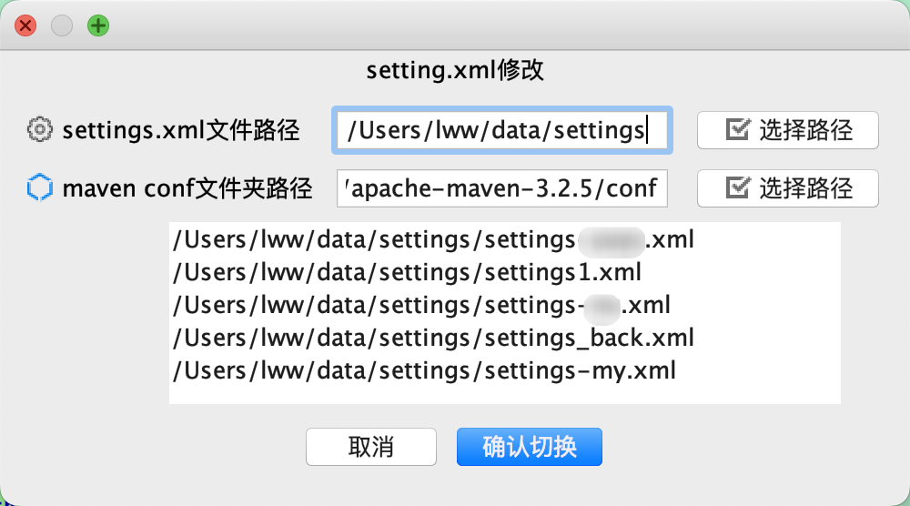
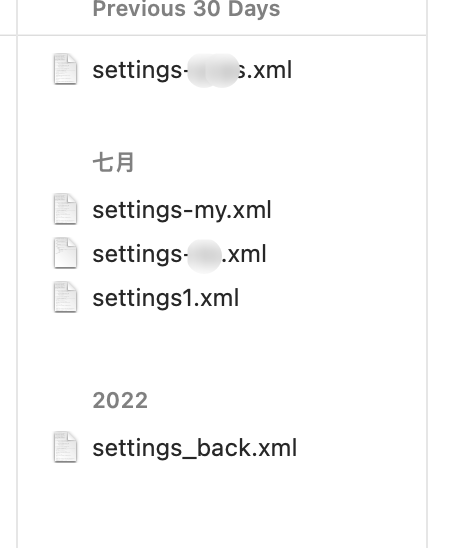
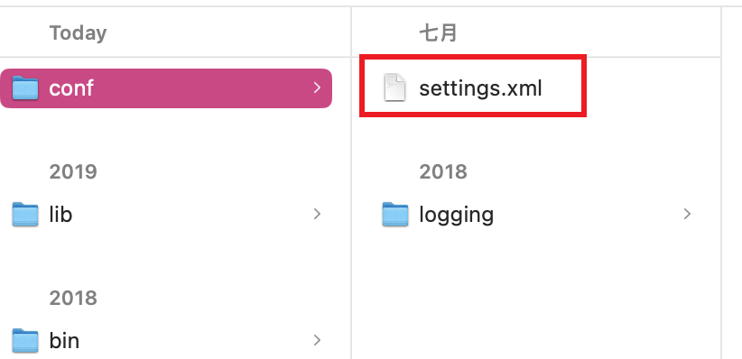
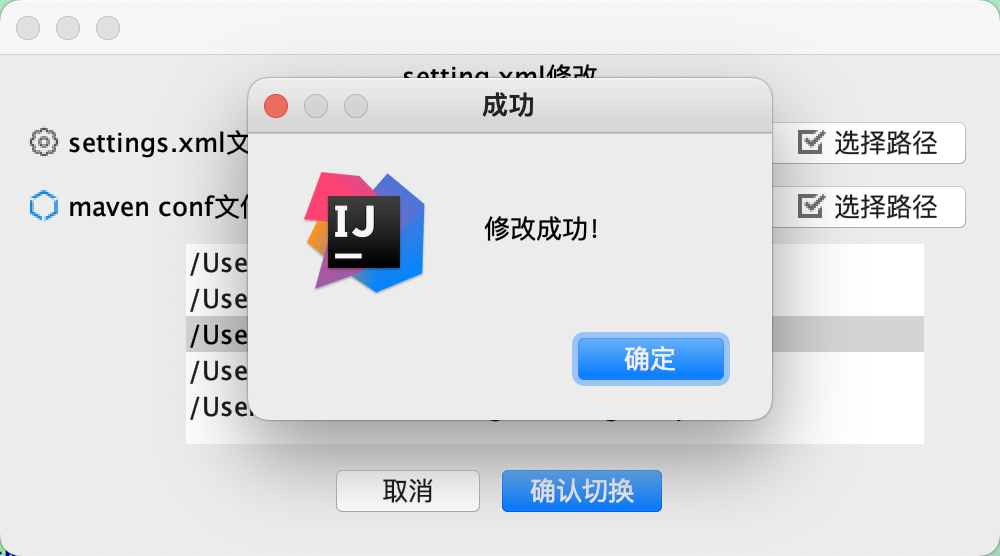

To manage the settings.xml file of Maven:  
You are required to set up two directories  
One of them is for storing various settings.xml files.  
Another one is the path of the conf folder of Maven.  
This plugin can help you replace the settings.xml file under the Maven conf folder with your other settings file from the first directory.

修改maven的 settings.xml 文件。  
    首先设置两个目录：  
    一个是存放各种 settings.xml 文件的目录路径。  
    一个是 Maven 程序下 conf 文件夹的路径。  
    从第一个目录中选择文件，替换 Maven 下 conf 中的 settings.xml 文件，并且重命名为 settings.xml  
     
    
 
 
 
 
 
 
 